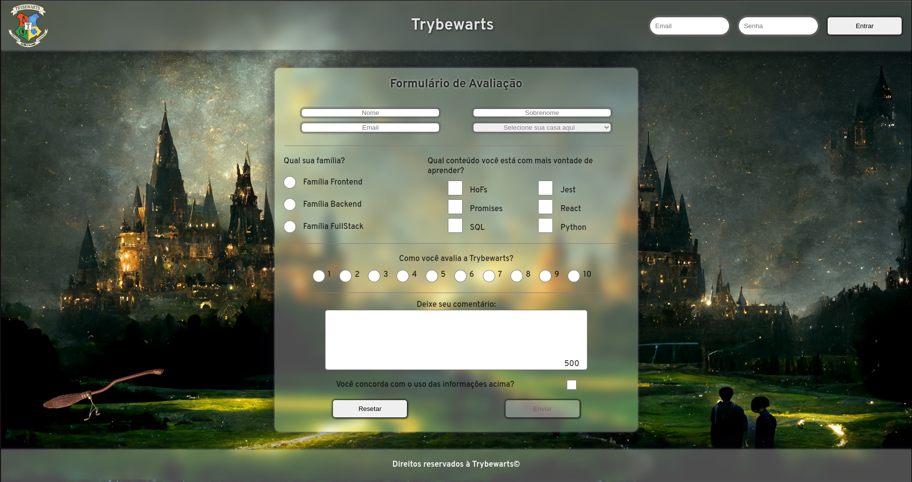

<h1 align="center">Trybewarts Project</h1>

Project where I could use my skills with JavaScript, HTML and CSS.  The Project was carried out in pairs and my pair was Bernardo Marques. Here is the link for his repository for this project: https://github.com/Bernmp-dev/Projeto-Trybewarts
<h2>Performance:</h2>

  

<h2>Visit the Project here:</h2>

https://mharmmer.github.io/Projeto-Trybewarts-Trybe/

<h2>Preview:</h2>

  

